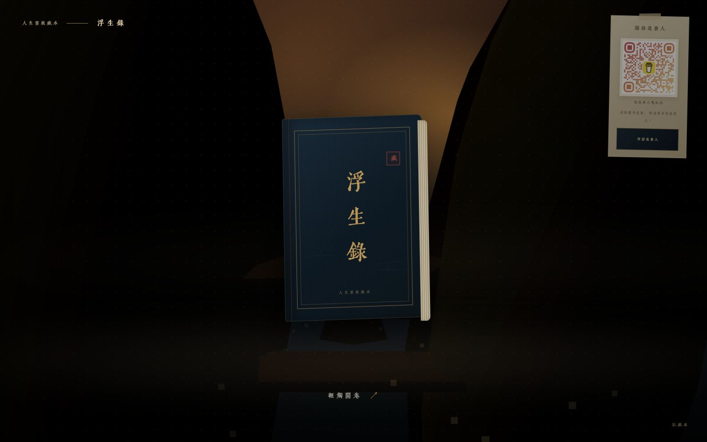
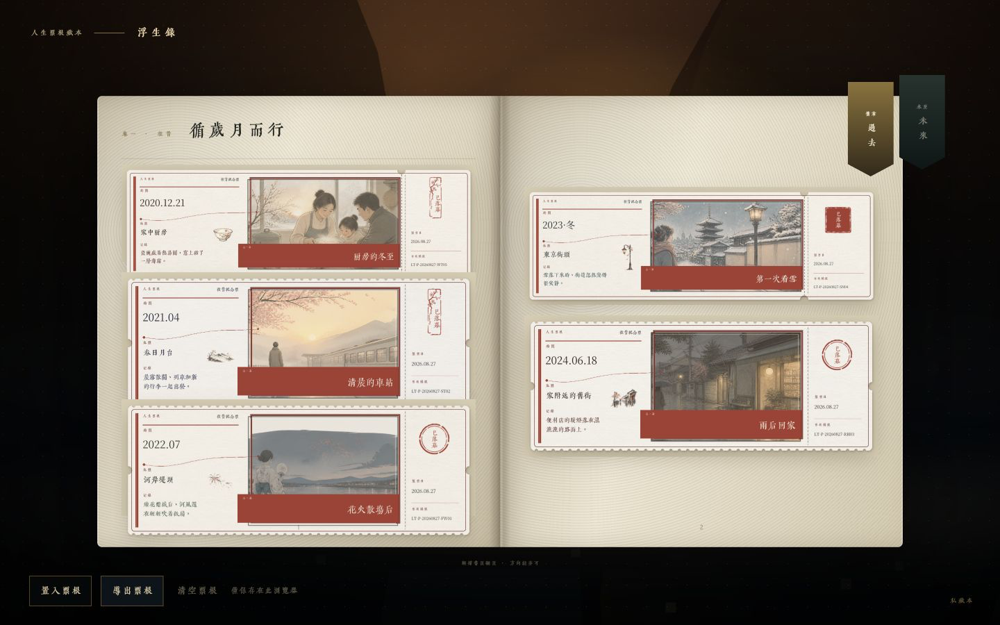
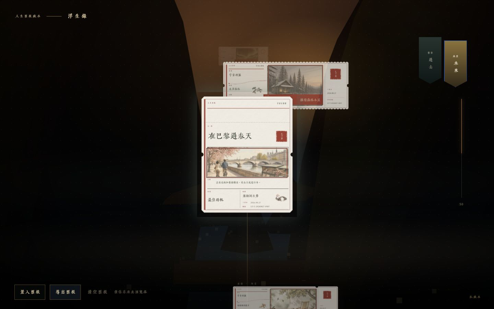
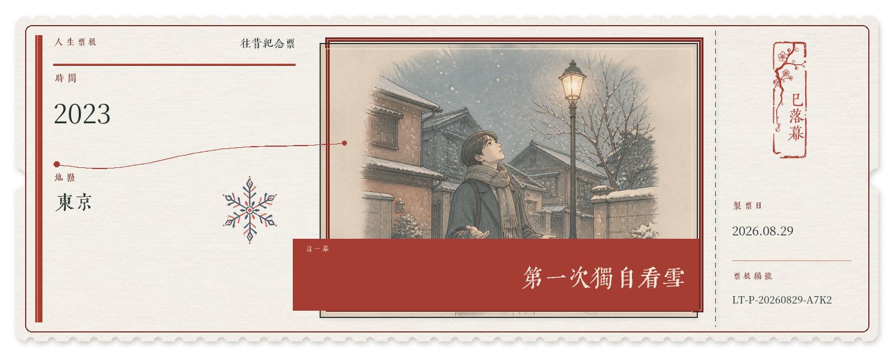

# B-PLUM-FushengRecords · 浮生录

> 把发生过的事和想抵达的未来，制成一张值得收藏的人生票根。

《浮生录》是一个面向 ChatGPT 与 Codex 的本地优先插件。它能把一段人生故事整理成复古票根，也能将票根收进一本可翻阅的互动古籍。你可以只做一张票，也可以从虚构样票开始生成一整套藏本，再慢慢换成自己的故事。

| 合书封面 | 过去篇 | 未来篇 |
| --- | --- | --- |
|  |  |  |

## 它会做什么

- 把已经发生的一幕做成“往昔纪念票”。
- 把希望体验或抵达的一幕写进“宇宙订单票”。它记录愿望，但不承诺结果。
- 提供幕间长票、胶片齿票，以及未来篇专属的章节方票。
- 建立默认只在本地运行的 Three.js 互动古籍。
- 将同名 PNG 与 JSON 票根成对收录，保留原始文件，不重绘、不裁切。
- 在没有个人票根时，准备明确标注为虚构的样票并完成造册。
- 在网页中置入、清空、恢复和导出票根。

## 三种常用流程

### 做一张个人票

讲述已经发生的一幕，或一个希望抵达的未来。插件会先整理出票单，列出标题、时间、地点、画面和装饰。只有你准确回复“出票”后，它才会生成同名 PNG 与 JSON。

```text
帮我制作一张人生票根。
```

### 生成一整套浮生录

如果你没有附上个人票根，只说“生成一整套浮生录”，插件不会立刻创建文件。它会先说明最终配置，包括默认的过去 5 张、未来 5 张虚构样票，并提醒你生成可能耗时。

确认时需要同时提供一个尚不存在的新输出目录，并准确回复“确认生成”。随后插件会依次准备样票、建立空册、收录票根、构建验证并打开本地预览。它不会覆盖旧目录，也不会自行发布网站。

```text
生成一整套浮生录。

确认生成，输出到 /path/to/my-fusheng-record
```

### 把样票换成自己的票

在藏本网页点击“清空票根”，可以清除当前浏览器后来置入的本地票，并隐藏清空当时已有的网站自带票。样票文件仍保留在藏本目录中，因此以后可以点击“恢复默认票根”重新显示。

接着在对话中制作个人票，再让收录 Skill 把同名 PNG 与 JSON 加入藏本。后来收录的新静态票号不在旧的隐藏集合中，会自动出现在网页里。

```text
把这些票根收录进 /path/to/my-fusheng-record
```

## 本地收藏与网页导出

拖入网页的票根使用 IndexedDB 保存，只存在于当前浏览器。网站自带票根保存在藏本目录中，两者遇到同一票号时，浏览器本地版本优先显示。

“导出票根”只存在于藏本网页，不再由独立 Skill 执行。按钮会导出当前未隐藏的网站自带票与 IndexedDB 本地票，并为每张票保留 PNG 和 JSON。隐藏的样票不会进入 ZIP，恢复后才会重新进入导出范围。

“清空票根”不会删除藏本目录中的原文件，也不会把已清除的 IndexedDB 本地票恢复回来。所有本地状态都限定在当前浏览器，不会自动云同步。

## 虚构示例

以下两张票只用于展示和测试，不对应作者或任何用户的真实经历。

| 往昔纪念票 | 宇宙订单票 |
| --- | --- |
|  |  |

正式票根由两个同名文件组成：PNG 是票面，JSON 保存可再次读取的数据。字段说明见 [`skills/make-life-ticket/references/ticket-data.md`](skills/make-life-ticket/references/ticket-data.md)。

## 安装

1. 克隆仓库：

   ```bash
   git clone https://github.com/Tabascoiiii/B-PLUM-FushengRecords.git
   ```

2. 在 ChatGPT 或 Codex 的 Plugins 页面添加本地插件来源，选择包含 `.codex-plugin/plugin.json` 的仓库根目录。
3. 启用“浮生录”，新建一个任务，然后直接讲述你想保存的一幕，或要求建立藏本。

这个仓库用于查看源码和本地安装。进入官方公共插件目录仍需单独提交审核。

## 隐私与数据

- 藏本默认在本地创建和保存，插件不会自行发布到互联网。
- 插件不内置开发者 API Key，也不会要求你把个人密钥写进仓库。
- 用户照片不会被复制进插件；票根 JSON 也不保存照片路径或二进制内容。
- 浏览器中后来置入的票根只保存在该浏览器的 IndexedDB 中。
- 请勿把包含真实个人经历的生成目录直接提交到公开仓库。

## 支持与商业定制

如果《浮生录》替你留住了一幕人生，可以[请造册人喝杯茶](https://buymeacoffee.com/plum.b)。这是自愿支持，不等同于购买商业授权。

商业使用、付费再分发、品牌活动或客户项目需要另行获得书面授权，请通过 [https://b-plum.com/](https://b-plum.com/) 联系作者。

## 许可证

- 软件代码：[`PolyForm Noncommercial 1.0.0`](LICENSE)，个人及非商用免费；商业使用需另行书面授权。
- 内置字体：各自遵循 `SIL Open Font License 1.1`，详见 [`THIRD_PARTY_NOTICES.md`](THIRD_PARTY_NOTICES.md)。

由于禁止商业使用，本项目准确地说是“源码公开 / source-available”，并非 OSI 定义下的开源软件。

---

## English

B-PLUM-FushengRecords is a local-first plugin for ChatGPT and Codex. It turns a life story into a collectible ticket and places tickets in an interactive album styled after a traditional Chinese book. You can make one ticket, or start with fictional samples and gradually replace them with your own stories.

### What it does

- Turns something that happened into a Past Memorial Ticket.
- Records a hoped-for experience as a Universe Order Ticket without treating the wish as a promise.
- Provides two horizontal ticket formats and a vertical `chapter-pass` reserved for the future chapter.
- Builds a local Three.js album that keeps the original PNG and JSON for every collected ticket.
- Prepares clearly fictional samples when you want a complete album but have not supplied personal tickets.
- Lets you import, clear, restore, and export tickets from the album page.

### Make one personal ticket

Describe something that happened or a future you hope to reach. The plugin first presents a ticket summary with the title, time, place, visual concept, and decoration. It creates the PNG and JSON only after you reply with the exact confirmation word `出票`.

```text
Make a life ticket for me.
```

### Generate a complete Fusheng Records album

If you ask for a complete album without attaching personal tickets, the plugin does not create files immediately. It first shows the final setup, including the default five fictional past tickets and five fictional future tickets, and warns that image generation may take time.

To proceed, reply with the exact phrase `确认生成` and provide a new output directory that does not already exist. The plugin then prepares the samples, creates an empty album, collects the tickets, validates the build, and opens a local preview. It never overwrites an existing directory or publishes the site on its own.

```text
Generate a complete Fusheng Records album.

确认生成, save it to /path/to/my-fusheng-record
```

### Replace the samples with your own tickets

Use “清空票根” on the album page to remove tickets added to this browser and hide the built-in tickets that existed at that moment. The sample files remain in the album directory, so “恢复默认票根” can show them again later.

Create personal tickets in the conversation, then ask the collection Skill to add each matching PNG and JSON pair to the album. Newly collected static ticket numbers are not part of the old hidden set, so they appear automatically.

```text
Collect these tickets into /path/to/my-fusheng-record
```

### Local storage and browser export

Tickets dropped onto the page are stored in IndexedDB and remain in that browser. Built-in tickets live in the album directory. If both sources contain the same ticket number, the browser-local version takes precedence.

Ticket export is available only through the album page, not through a separate Skill. The button creates a ZIP containing every currently visible built-in ticket and every IndexedDB ticket, with both PNG and JSON preserved. Hidden samples stay out of the ZIP until you restore them.

Clearing the album does not delete source files from the album directory. It also cannot restore IndexedDB tickets that were cleared. These browser states are local and are not synced to a cloud service.

### Fictional examples

The two tickets shown above are fictional demonstration data. They do not describe the author or any user. Each finished ticket consists of a matching PNG and JSON pair.

### Install

```bash
git clone https://github.com/Tabascoiiii/B-PLUM-FushengRecords.git
```

In the ChatGPT or Codex Plugins page, add a local plugin source and select the repository root containing `.codex-plugin/plugin.json`. Enable **B-PLUM-FushengRecords**, start a new task, and describe the moment or album you want to make.

### Privacy

Albums stay local unless you choose to publish them. The plugin ships without a developer API key and never asks you to commit a personal key. It does not copy user photos into the plugin or store photo paths and binary data in ticket JSON. Tickets added through the album page stay in that browser's IndexedDB. Keep generated albums containing private stories out of public repositories.

### Support and commercial work

If Fusheng Records helped you keep a moment, you can [buy the maker a coffee](https://buymeacoffee.com/plum.b). This is voluntary support, not a commercial license. Commercial use, paid redistribution, brand campaigns, and client work require separate written permission. Contact the author through [https://b-plum.com/](https://b-plum.com/).

### Licensing

- Software: [PolyForm Noncommercial 1.0.0](LICENSE).
- Bundled fonts retain their SIL Open Font License 1.1 terms; see [third-party notices](THIRD_PARTY_NOTICES.md).

Because commercial use is restricted, this project is source-available rather than OSI-approved open source.

## License scope

The software is released under the [PolyForm Noncommercial License 1.0.0](https://polyformproject.org/licenses/noncommercial/1.0.0). Unless explicitly stated otherwise, documentation, screenshots, and example artwork are not separately licensed and remain protected by copyright. Third-party fonts and other external materials remain under their respective licenses.
