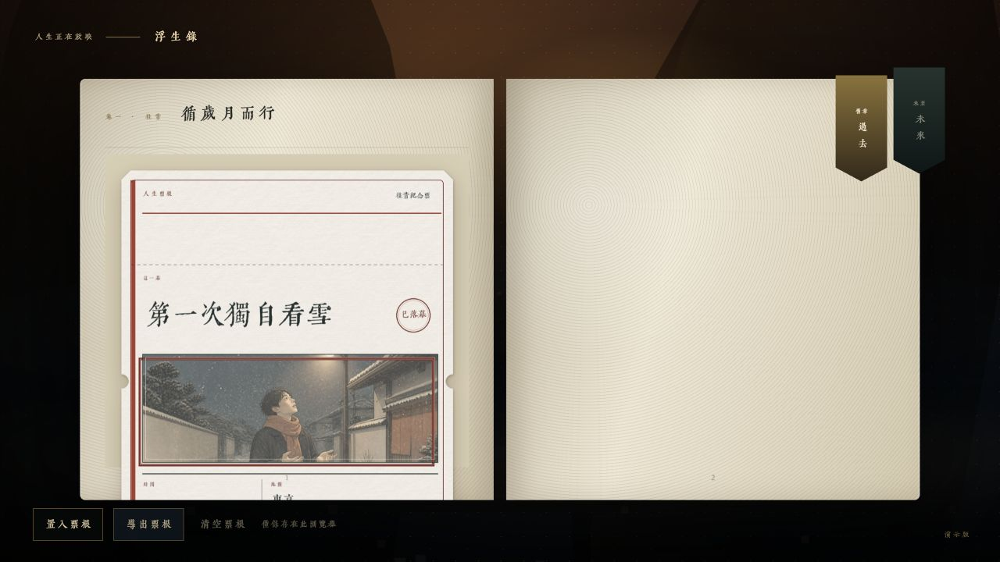
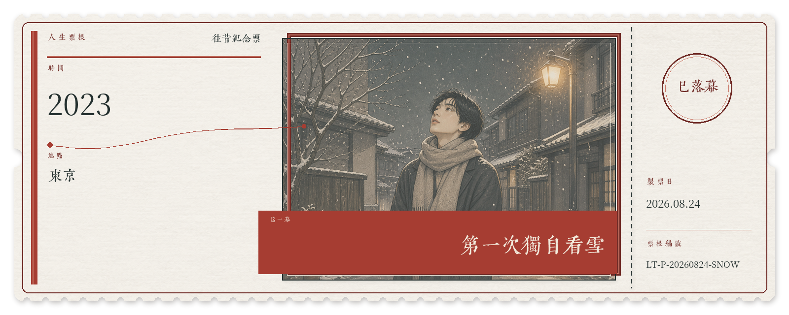
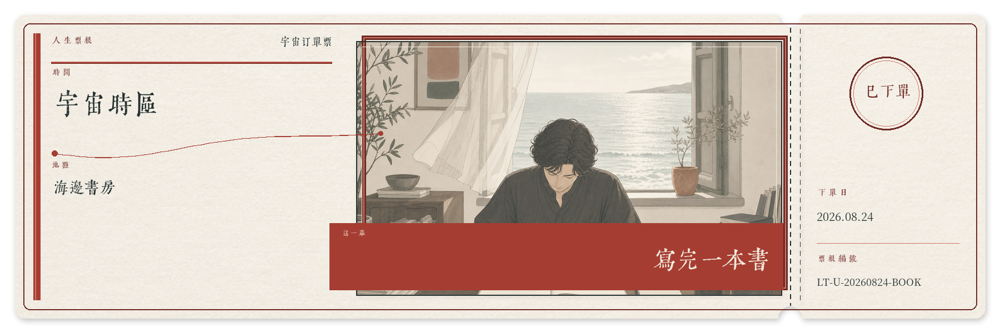

# B-PLUM-FushengRecords · 浮生录

> 把发生过的事和想抵达的未来，制成一张值得收藏的人生票根。

《浮生录》是一个面向 ChatGPT 与 Codex 的本地优先插件。它把自然语言故事转译为复古收藏票根，并将票根收进可浏览的互动古籍。插件包含出票、造册、收录、样票植入和无损导出等完整工作流。



## 可以做什么

- 制作“往昔纪念票”，收藏已经发生的人生片段。
- 制作“宇宙订单票”，温柔记录希望体验或抵达的一幕，不把愿望描述为结果保证。
- 往昔纪念票使用两种横向长票；宇宙订单票在此基础上增加未来专属的竖向章节方票，共三种。
- 建立默认本地运行的互动古籍藏册。
- 将同名 PNG 与 JSON 票根收录进藏册。
- 植入完全虚构的演示票，方便测试和展示。
- 将藏册中的票根无损导出为 ZIP。

## 效果示例

以下示例均为虚构内容，不对应任何真实个人经历。

| 往昔纪念票 | 宇宙订单票 |
| --- | --- |
|  |  |

每张正式票根都由同名 PNG 与 JSON 组成，结构说明见 [`skills/make-life-ticket/references/ticket-data.md`](skills/make-life-ticket/references/ticket-data.md)。

## 安装

1. 克隆仓库：

   ```bash
   git clone https://github.com/AKIIIIIIIIIII/B-PLUM-FushengRecords.git
   ```

2. 在 ChatGPT 或 Codex 的 Plugins 页面添加本地插件来源，选择包含 `.codex-plugin/plugin.json` 的仓库根目录。
3. 启用“浮生录”，然后在新任务中使用下面的提示词。

本仓库提供插件源码和本地安装包；提交到官方公共插件目录是单独的审核流程，不包含在本次发布中。

## 使用示例

```text
帮我制作一张人生票根。
为我建立一本空白人生藏册。
用样票生成一本可浏览的《浮生录》。
把这些票根收录进我的浮生录。
导出藏册里的全部票根。
```

插件会在生成个人票根前整理出票单并等待明确确认；样票始终标注为虚构演示。

## 隐私与数据

- 默认在本地创建和保存藏册，不主动发布到互联网。
- 插件不内置开发者 API Key，也不会要求把个人密钥写入仓库。
- 用户照片不会被复制进插件，票根 JSON 不保存照片路径或二进制内容。
- 请勿把包含真实个人经历的生成目录直接提交到公开仓库。

## 支持与商业定制

如果它替你留住了一幕人生，可以[请造册人喝杯茶](https://buymeacoffee.com/plum.b)。打赏是自愿支持，不代表购买商业授权。

商业使用、付费再分发、品牌活动或客户项目需要另行获得书面授权，请通过 [https://b-plum.com/](https://b-plum.com/) 联系作者。

## 许可证

- 软件代码：[`PolyForm Noncommercial 1.0.0`](LICENSE)，个人及非商用免费；商业使用需另行书面授权。
- 内置字体：各自遵循 `SIL Open Font License 1.1`，详见 [`THIRD_PARTY_NOTICES.md`](THIRD_PARTY_NOTICES.md)。

由于禁止商业使用，本项目准确地说是“源码公开 / source-available”，并非 OSI 定义下的开源软件。

---

## English

B-PLUM-FushengRecords is a local-first plugin for ChatGPT and Codex. It turns personal moments and gently framed future wishes into collectible life tickets, then keeps those PNG/JSON pairs inside an interactive book-inspired album.

Past Memorial Tickets use two horizontal ticket shapes. Universe Order Tickets support those two plus the future-only vertical `chapter-pass` shape.

### Features

- Create Past Memorial Tickets for moments that already happened.
- Create Universe Order Tickets for experiences you hope to reach, without promising outcomes.
- Build a local interactive album.
- Collect matching PNG and JSON ticket pairs.
- Add clearly fictional sample tickets for demonstrations and testing.
- Export all tickets without altering the originals.

### Install

```bash
git clone https://github.com/AKIIIIIIIIIII/B-PLUM-FushengRecords.git
```

In the ChatGPT or Codex Plugins page, add a local plugin source and select the repository root containing `.codex-plugin/plugin.json`. Enable **B-PLUM-FushengRecords** and start a new task.

### Example prompts

```text
Make a life ticket for me.
Create an empty B-PLUM-FushengRecords album.
Build a browsable album with fictional sample tickets.
Collect these tickets into my album.
Export every ticket from the album.
```

### Privacy

Albums are local by default. The plugin ships no developer API key, does not publish automatically, and does not store user-photo paths or binary data in ticket JSON. Do not commit private generated albums to a public repository.

### Support and commercial work

You can [buy the maker a coffee](https://buymeacoffee.com/plum.b). Donations are voluntary support and do not grant a commercial license. Commercial use, paid redistribution, brand campaigns, and client work require separate written permission. Contact the author through [https://b-plum.com/](https://b-plum.com/).

### Licensing

- Software: [PolyForm Noncommercial 1.0.0](LICENSE).
- Bundled fonts retain their SIL Open Font License 1.1 terms; see [third-party notices](THIRD_PARTY_NOTICES.md).

Because commercial use is restricted, this project is source-available rather than OSI-approved open source.

## License scope

The software is released under the [PolyForm Noncommercial License 1.0.0](https://polyformproject.org/licenses/noncommercial/1.0.0). Original documentation, screenshots, and example artwork are covered separately by LICENSE-CONTENT.md. Third-party fonts and other external materials remain under their respective licenses.

## License scope

The software is released under the [PolyForm Noncommercial License 1.0.0](https://polyformproject.org/licenses/noncommercial/1.0.0). Unless explicitly stated otherwise, documentation, screenshots, and example artwork are not separately licensed and remain protected by copyright. Third-party fonts and other external materials remain under their respective licenses.
